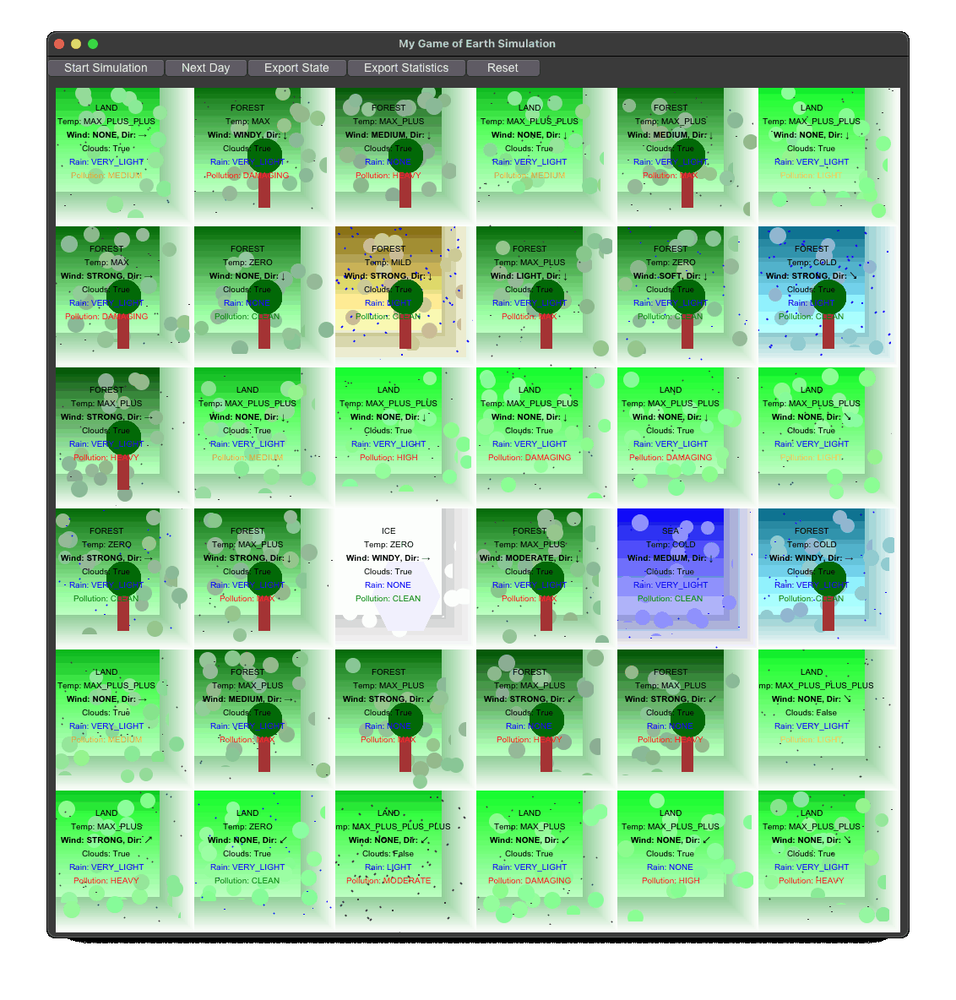
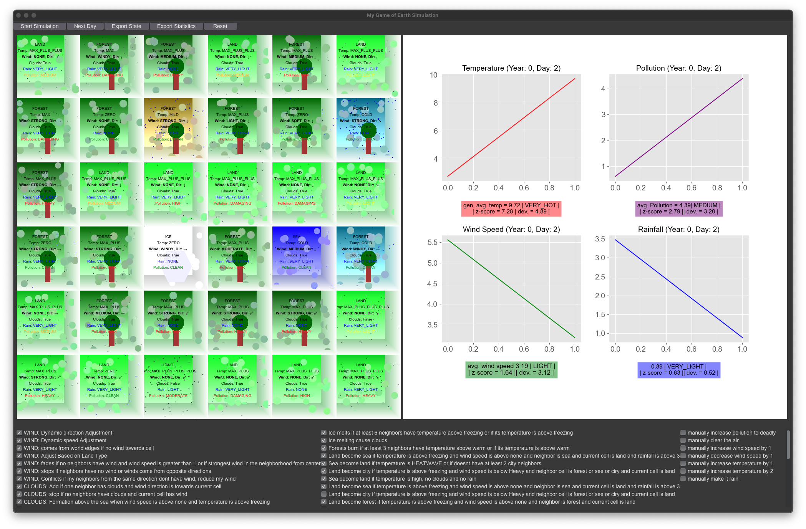
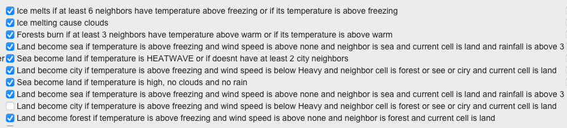
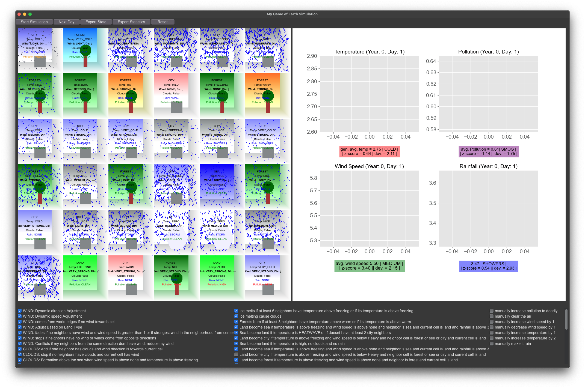
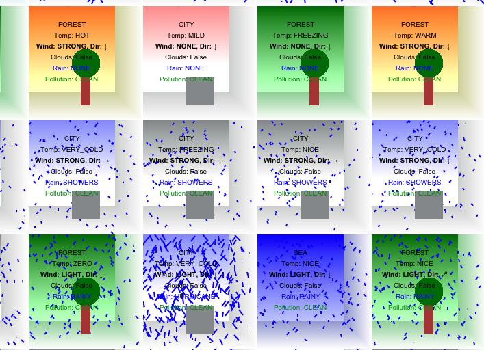

# 🌍 Simulation Earth

Welcome to "Simulation Earth" - a groundbreaking project that models our planet using the principles of `cellular automata`. Inspired by Conway's Game of Life, this 2D `grid-based simulation` vividly illustrates the complexity of Earth's ecosystems.

In each cell of the grid, diverse ecosystems are represented, ranging from seas and mountains to urban landscapes. Key environmental attributes like temperature, wind speed, rainfall, and pollution levels are dynamically simulated. As each generation progresses, the cells' states evolve, creating a rich tapestry of interconnected ecological phenomena.

Developed for the **Biological Computation** class at the _Open University of Israel_ in 2024, this project earned a perfect score of `100/100`.

<p align="center">
  
</p>

---

<!-- @import "[TOC]" {cmd="toc" depthFrom=2 depthTo=2 orderedList=false} -->

<!-- code_chunk_output -->

- [🌳 Background](#-background)
- [🌟 Key Features](#-key-features)
- [🚀 Getting Started](#-getting-started)
- [💡 Insights and Usage](#-insights-and-usage)
- [🛠️ Technical Implementation](#️-technical-implementation)
- [🖼️ Screenshots](#️-screenshots)
- [📜 License](#-license)
- [📫 Contact](#-contact)

<!-- /code_chunk_output -->

---

## 🌳 Background

A cellular automata is a Computation model that is based on a world (grid) of cells, where each cell has a state and a set of rules that determine the state of the cell in the next generation. The rules are based on the state of the cell and the state of its neighbours. The rules are applied to all cells in the grid at the same time, and the next generation is calculated based on the current generation.

The cellular automata model is a powerful tool for modeling complex systems, such as ecosystems, traffic flow, and even social dynamics. The model is based on the idea that complex systems can emerge from simple rules and interactions between individual elements. By simulating the interactions between individual elements, the model can capture the emergent properties of the system as a whole.

For more information about cellular automata, see [Wikipedia](https://en.wikipedia.org/wiki/Cellular_automaton).

This project is a simulation of Earth's ecosystem using cellular automata. The simulation is based on a 2D grid of cells, where each cell represents a different part of the ecosystem, such as the sea, mountains, or urban areas. The cells have different attributes, such as temperature, wind speed, rainfall, and pollution levels. The simulation evolves over time, with the cells' states changing based on the rules of the simulation.

## 🌟 Key Features

<p align="center">
  
</p>

- 🌐 **Dynamic World Modeling:** Explore complex cause-effect relationships as each cell's behavior evolves based on its environment and neighboring cells.

- 🖥️ **Real-time Visualization:** Watch ecological patterns unfold in real time, with the ability to adjust initial conditions and monitor the simulation's progress.

- 🔩 **Modular Design:** Experiment with different simulation rules and initial states, adaptable to scenarios from board games to real-world ecosystem modeling.

- 📊 **Statistical Analysis:** Delve into detailed statistics such as average values, standard deviation, and standard error, enriching the analytical depth.

---

## 🚀 Getting Started

### 📦 Requirements

- `matplotlib`: Powers the visualizations.
- `tkinter`: Drives the GUI interface.

### 🏃 Running the Simulation

1. **Prepare the Environment:** Ensure `csv` files are placed in the same directory as the program.
2. **Launch the Simulation:**

    ```bash
    python3 grid.py
    # If multiple Python versions are installed:
    python3.11 grid.py
    ```

3. **Customize Your Experience:** Modify simulation parameters, select initial states, and apply rules through the intuitive GUI.

### 🧪 Testing and Analysis

- **Example State:** Discover with `enums.csv`, which provides a sample initial state.
- **Rich Data:** Access comprehensive statistics for in-depth analysis and insights.
- **Rule Exploration:** Dive into various ecological outcomes by experimenting with different initial states and rules.

    <p align="center">
        Example Rule Exploration:
        
        
        
    </p>

---

## 💡 Insights and Usage

"Simulation Earth" is more than just a project; it's a journey into the interconnectedness of our environment. Through detailed testing and rule adjustment, we've uncovered significant correlations between pollution levels and other environmental aspects. The `manually increase temperature` rule, for example, demonstrates the profound impact of individual factors on the broader ecosystem.

---

## 🛠️ Technical Implementation

- 🧬 **Cellular Automaton Core:** A seamless blend of Python's capabilities with the core theories of cellular automata.

- 🎲 **State and Neighbors:** Cells in a 2D array ([CA.py](CA.py)) each possess a unique state ([states.py](state.py)) and a Moore neighborhood configuration.

- 🏷️ **Custom Enum Classes:** Enhance rule implementation and maintain finite state values, ensuring robustness and preventing errors.

- 📏 **Grid and GUI Separation:** The `grid` class ([grid.py](grid.py)) handles cell layout and state transitions, while the `GUI` class ([GUI.py](GUI.py)) manages simulation control.

- 👨‍⚖️ **Dynamic Rules and Initial States:** The [rules.py](rules.py) and [enums.csv](enums.csv) files enable easy customization of simulation rules and initial states.

### 🛠️ Advanced Coding Techniques and Concepts

The project's simple appearance belies the advanced techniques and concepts that underpin the simulation. By examining specific code snippets, including the `update_state` method from the `Cell` class and rules from the `TransitionRules` class, we can explore how these advanced techniques contribute to a robust, adaptable, and user-friendly simulation environment.

**Key Code Snippets:**

1. **Cell Class - State Update Method:**

    ```python
    def update_state(self):
        rules = TransitionRules(self)
        with rules:
            return rules.apply_rules()
    ```

2. **TransitionRules Class - Sample Rules for Rain, Air Quality, and Temperature:**

    ```python
    # Rain Rule: Stop rain if no neighbors have clouds and current cell has wind
    # Air Quality Rule: Cities create pollution based on the number of city neighbors
    # Temperature Rule: Pollution increases temperature
    {
        'name': 'TEMP: Pollution increases temperature',
        'enabled': True,
        'condition': lambda neighborhood: neighborhood['center'].air_pollution > AirQuality.CLEAN,
        'action': lambda neighborhood: setattr(neighborhood['center'], 'temperature', neighborhood['center'].temperature + neighborhood['center'].air_pollution.value)
    },
    ```

3. **Custom Comparable Enum Class:**

    ```python
    class ComparableEnum(Enum):
        # Custom comparison methods (__lt__, __le__, __gt__, __ge__)
        ...
    ```

4. **Dynamic GUI Interaction:**

    ```python
    def setup_rules_checkboxes(self):
        # GUI setup for dynamic rule modification
        ...
    def update_rule_state(self, rule, var):
        # Method to update rule state based on GUI interaction
        ...
    ```

**Analysis of Techniques:**

1. **Enhanced Encapsulation in the Cell Class:**
   The `Cell` class demonstrates encapsulation, managing its state internally. The `update_state` method leverages `TransitionRules` to handle state transitions, keeping the logic neatly contained.

2. **Complex Rule-Based Logic in TransitionRules:**
   The selected rules illustrate the complexity of interactions within the simulation. Each rule encapsulates specific environmental logic, such as how rain, air quality, and temperature interact with other elements.

3. **Context Manager for Controlled Rule Application:**
   The `TransitionRules` class employs a context manager to apply rules in a controlled and precise manner. This ensures that the simulation's state changes are coherent and that side effects are minimized.

4. **Dynamic GUI for Real-Time Interactivity:**
   The GUI setup enables real-time, dynamic modifications of the simulation rules, showcasing an advanced level of user interactivity and responsiveness to user inputs.

5. **Type Safety and Flexibility with Custom Enums:**
   The `ComparableEnum` class extends Python's Enum, facilitating easy comparisons crucial for rule implementation. This ensures type safety and enhances the simulation's flexibility in modeling complex environmental interactions.

These advanced techniques not only demonstrate robust programming practices but also underscore the project's dedication to creating a sophisticated, adaptable, and user-friendly simulation environment.

---

## 🖼️ Screenshots

*Explore the GUI Interface and Statistics Panels*

<p align="center">
    The 3D effect is achieved by using a 2D grid with a color gradient.
  
</p>

*Delve into Detailed Statistical Analysis Over Time*

<p align="center">
  
</p>

*Uncover the Correlation Between Pollution and Temperature*

<p align="center">
  
</p>

<p align = "center">
  
  
</p>

---

## 📜 License

This project is open-sourced under the MIT License - see the [LICENSE](LICENSE) file for details.

---

## 📫 Contact

For inquiries, collaborations, or more information, feel free to connect with me on [LinkedIn](https://www.linkedin.com/in/dor-pascal/).
